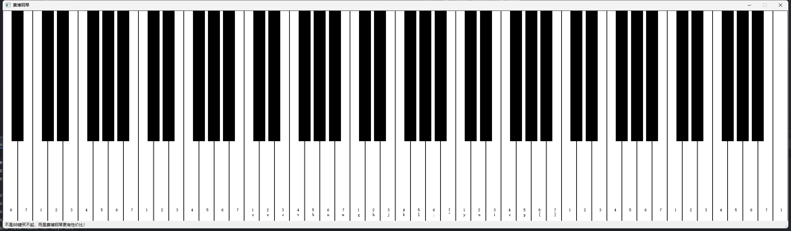

# CyberPiano

欢迎来到赛博钢琴项目！这是一个通过键盘和鼠标模拟钢琴弹奏的项目。

## 项目概述

前不久博主精心筹备，欲在女友生辰之际，以一份特别的礼物——一台37键的童趣钢琴，为她编织一段温馨的记忆。怎料，这份心意与紧随其后的七夕佳节完美邂逅，却因工作的突然召唤，让博主不得不带着遗憾踏上异乡的征途，错过了亲自弹奏《两只老虎》的温馨时刻。

望着视频中女友指尖跳跃，旋律悠扬，那份未能亲临现场的遗憾化作了创新的火花。博主灵机一动，决定跨越千山万水，用指尖下的键盘，在数字世界中续写音乐的浪漫。说干就干，经过一番不懈的努力与探索，几个小时后，一个别出心裁的“键盘钢琴”奇迹般地诞生了！

请允许我们一同见证这创意的结晶。

### 效果图

### 技术栈

- 使用python 3.7版本
- 使用PyQt5实现界面绘制。
- 使用pygame库播放音乐，会更加流畅、连贯。
- 使用keyboard实现键盘监控。
- 使用Thread多线程，防止pygame和PyQt5线程冲突。

## 使用方法

- 运行main.py。
- 使用鼠标或键盘键控制钢琴。
- 键盘映射可以在piano_key.json中修改。

## 问题和讨论

如果你有任何问题或建议，请在这里提出：https://github.com/guyu0327/CyberPiano/issues

---
